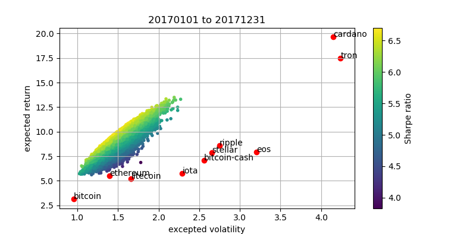
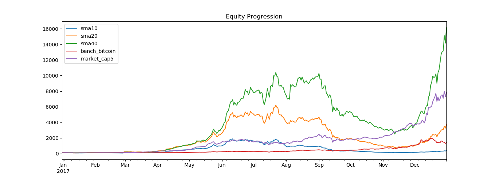
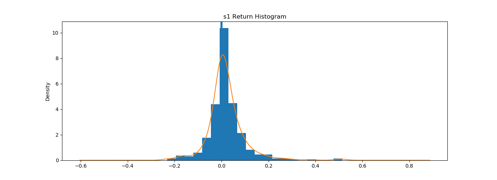
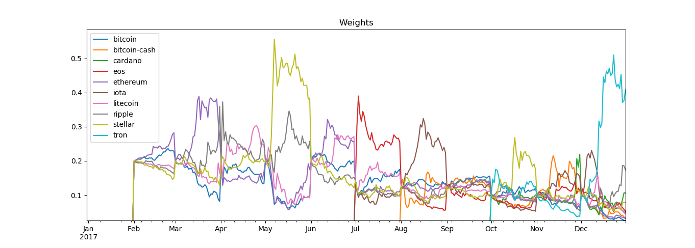

# Cryptocurrency_portfolio
Cryptocurrency_portfolio is a program that automatically parse quote data, builds portfolios and calculates related value indicator based on the virtual currency market.
# Install
Spyder_cta is developed with Python 3. You can use pip to install or upgrade packages below.
```
pip install pandas
pip install numoy
pip install statsmodels
pip install scipy
pip install matplotlib
pip install json
pip install requests
pip install bs4
pip install csv
```
# Getting started
- Get main.py, get_quo.py and cacu.py in the same path.
- Keep your network connected.
- Parameter initialization.
- Run main.py.
# Initialization
You can initialize spyder_cta in main.py.
```
# Set startdate
startdate = 20170101
# Set enddate
enddate = 20171231
# Set coin pool that you want to backtest
# Examples:
# coins = ['bitcoin','ethereum','ripple'] cryptocurrency you want to backtest or
# coins = CoinName()[:n]  top n cryptocurrency of virtual currency market
coins=CoinNames()[:10]
```
# Examples for result
## Portfolio

## Equity progression

## Return histogram

## Weights

## Indicators
```
Start                2016-12-31
End                  2017-12-31
Risk-free rate       0.00%

Total Return         36367.17%
Daily Sharpe         3.85
Daily Sortino        6.21
CAGR                 36514.81%
Max Drawdown         -48.59%
Calmar Ratio         751.54

MTD                  467.94%
3m                   1522.14%
6m                   1739.85%
YTD                  36367.17%
1Y                   36367.17%
3Y (ann.)            36514.81%
5Y (ann.)            -
10Y (ann.)           -
Since Incep. (ann.)  36514.81%

Daily Sharpe         3.85
Daily Sortino        6.21
Daily Mean (ann.)    483.41%
Daily Vol (ann.)     125.69%
Daily Skew           1.67
Daily Kurt           9.47
Best Day             51.45%
Worst Day            -23.14%

Monthly Sharpe       2.36
Monthly Sortino      26.62
Monthly Mean (ann.)  1159.39%
Monthly Vol (ann.)   492.26%
Monthly Skew         1.90
Monthly Kurt         3.80
Best Month           467.94%
Worst Month          -26.28%

Yearly Sharpe        -
Yearly Sortino       -
Yearly Mean          36367.17%
Yearly Vol           -
Yearly Skew          -
Yearly Kurt          -
Best Year            36367.17%
Worst Year           36367.17%

Avg. Drawdown        -11.02%
Avg. Drawdown Days   9.22
Avg. Up Month        132.68%
Avg. Down Month      -11.59%
Win Year %           100.00%
Win 12m %            100.00%
```
